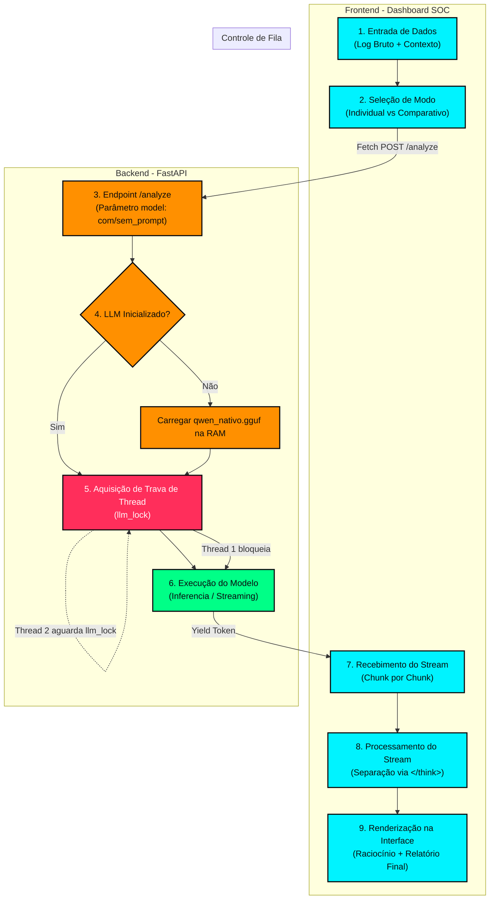

# Alunos: Álex Rios e Wesley Rios
# 🛡️ CyberSentinel — Analista SOC Virtual Especialista em Cibersegurança

Este projeto apresenta a proposta conceitual e a implementação funcional de um **Agente Inteligente Especialista** treinado para atuar no domínio de cibersegurança como um Analista SOC (Security Operations Center) Virtual.

O agente é capaz de receber logs de segurança de servidores, alertas de firewalls/IDS e relatórios de vulnerabilidades, processar esses dados sob a ótica de mitigação de incidentes, mapeá-los para técnicas reais da matriz **MITRE ATT&CK** e sugerir ações de contenção acionáveis para administradores de infraestrutura.

---

## 📋 Sumário
1. [Definição do Problema Real](#-definição-do-problema-real)
2. [Como o Agente Funciona](#-como-o-agente-funciona)
3. [Arquitetura PEAS do Agente Inteligente](#-arquitetura-peas-do-agente-inteligente)
4. [Entradas, Processamento e Saídas](#-entradas-processamento-e-saídas)
5. [Fluxograma de Funcionamento](#-fluxograma-de-funcionamento)
6. [Engenharia de Prompt e Estruturação de Persona SOC](#-engenharia-de-prompt-e-estruturacao-de-persona-soc)
7. [Interface Customizada (Dashboard SOC)](#-interface-customizada-dashboard-soc)
8. [Instruções para Execução Local](#-instruções-para-execução-local)

---

## 🔍 Definição do Problema Real

O cenário moderno de ameaças digitais é crítico. Somente em 2024, o Brasil sofreu mais de **100 bilhões de tentativas de ataques cibernéticos**. Ao mesmo tempo, há um déficit global estimado de **3.5 milhões de profissionais de cibersegurança**. 

Pequenas e médias empresas (PMEs) enfrentam um grande dilema:
- Não possuem recursos financeiros para contratar analistas de segurança humanos (SOC) dedicados.
- Ferramentas tradicionais geram alertas de segurança complexos em arquivos de log brutos que gerentes de TI genéricos não sabem interpretar nem mitigar a tempo.

**O CyberSentinel resolve este problema:** Ele atua como um triador de incidentes de primeiro nível em cibersegurança de baixo custo, traduzindo logs incompreensíveis em relatórios estruturados de ameaças com planos de ação claros.

---

## ⚙️ Como o Agente Funciona

O **CyberSentinel** baseia-se no conceito de **Agente Inteligente Baseado em Objetivos e Regras de Decisão**. Seu ciclo de funcionamento consiste em um fluxo contínuo de percepção do ambiente, processamento lógico de regras sob a luz de conhecimentos específicos de segurança e, finalmente, atuação na interface.

1. **Percepção (Sensors)**: O agente lê logs crus informados e o contexto operacional (criticidade e setor de rede).
2. **Deliberação e Raciocínio (Thinking Process)**: Ao receber a entrada, o backend do agente prepara a entrada do modelo em blocos no padrão ChatML. Um direcionador de raciocínio pré-preenche a resposta com a tag `<think>`. A IA inicia gerando seu processo de raciocínio passo a passo (Chain-of-Thought) inteiramente em português do Brasil, delimitando as etapas de triagem antes de emitir a resposta.
3. **Ação (Actuators)**: O agente encerra a tag `</think>` e gera o relatório padronizado estruturando as seções Markdown exigidas. A saída é entregue ao frontend via fluxo contínuo (Streaming), que realiza a filtragem do raciocínio e do parecer final.
4. **Resiliência e Concorrência**: Para evitar estouro de memória e crashes de thread-safety no backend (visto que o `llama.cpp` não aceita geração paralela concorrente no mesmo arquivo em memória), o agente utiliza um mecanismo de trava (`llm_lock`), enfileirando requisições concorrentes de modo seguro.

---

## 🏛️ Arquitetura PEAS do Agente Inteligente

De acordo com a teoria de agentes inteligentes (Russell & Norvig), o CyberSentinel é caracterizado pela seguinte estrutura PEAS:

- **P**erformance (Medidas de Desempenho): 
  - Acurácia na identificação correta do vetor de ataque.
  - Alinhamento preciso com a classificação de técnicas **MITRE ATT&CK**.
  - Qualidade prática do plano de resposta (contenção, erradicação, recuperação).
  - Baixo tempo de resposta (latência de inferência local).
- **E**nvironment (Ambiente):
  - Logs brutos do sistema operacional (Syslog, SSH logins).
  - Logs de servidores Web (Apache, Nginx, IIS).
  - Alertas gerados por IPS/IDS e Firewalls.
  - Relatórios textuais de vulnerabilidades (CVEs).
- **A**ctuators (Atuadores):
  - Dashboard SOC interativo com análise em tela.
  - Relatórios técnicos formatados em Markdown.
  - Exportação de planos de mitigação e bloqueios de IPs/Portas.
- **S**ensors (Sensores):
  - Caixa de entrada de texto e upload de arquivos de log do Dashboard.
  - Informações de contexto organizacional (importância do ativo, setor da empresa).

---

## 🔄 Entradas, Processamento e Saídas

```
 📥 ENTRADA (Logs/CVE/Contexto) ──▶ 🧠 PROCESSAMENTO (LLM Local + System Prompt) ──▶ 📤 SAÍDA (Dashboard/Mapeamento/Ações)
```

### 1. Entradas (Sensors)
O agente recebe duas fontes de informação:
- **Log Bruto ou Descrição do Incidente:** O log cru do evento de segurança.
- **Contexto da Organização:** A criticidade do servidor afetado e o nicho de mercado (ajuda a ajustar o impacto de Confidencialidade, Integridade e Disponibilidade - CIA).

### 2. Processamento (CPU / Local GGUF)
O processamento é realizado pelo modelo de linguagem local (**Qwen3.5-2B**) executado localmente em CPU através do motor de inferência `llama-cpp-python`.
O processamento envolve:
1. **Parsing da Entrada:** Extração de metadados de logs brutos como IPs de origem, portas, usuários e payloads maliciosos.
2. **Chaveamento e Engenharia de Prompt:** O backend monta o prompt combinando as entradas com as diretrizes de persona e estruturação do `SYSTEM_PROMPT`.
3. **Inferência Comparativa:** O motor executa a geração em formato de fluxo de dados (streaming). É possível chavear e comparar o comportamento original do modelo base (Sem Prompt) com o comportamento guiado pelo prompt (Com Prompt).

### 3. Saídas (Actuators)
A resposta gerada pelo modelo é formatada rigidamente no seguinte padrão:
- **Classificação da Ameaça:** Tipo exato de ataque (ex: *Brute Force*, *SQL Injection*, *Privilege Escalation*) e sua Severidade (Critica, Alta, Média, Baixa ou Informativa).
- **Mapeamento MITRE ATT&CK:** Mapeia o log para uma Tática e Técnica real (ex: *Tática: Credential Access (TA0006)*, *Técnica: Brute Force (T1110)*).
- **Análise de Impacto (CIA Triad):** Avaliação de quão afetados foram a Confidencialidade, Integridade e Disponibilidade dos sistemas.
- **Plano de Resposta a Incidentes:** Passos claros de **Contenção** (ex: bloquear IP no firewall), **Erradicação** (ex: remover usuário comprometido) e **Recuperação** (ex: restaurar backup).
---

## 📊 Fluxograma de Funcionamento

O diagrama abaixo detalha a arquitetura geral do sistema, desde a entrada de logs pelo analista até a renderização inteligente do parecer no dashboard, destacando a sincronização de threads no servidor FastAPI:



### Detalhamento do Fluxo:
1. **Entrada:** O usuário submete o log e o contexto operacional no frontend.
2. **Modo:** Caso o usuário ative o modo comparativo, o frontend dispara duas requisições HTTP paralelas via `Promise.all` (`/analyze?model=sem_prompt` e `/analyze?model=com_prompt`).
3. **Backend & Fila:** As requisições chegam concorrentemente no backend FastAPI. O middleware desativa o cache e chama a rota correspondente.
4. **Lock de Thread:** Como a biblioteca `llama-cpp-python` não é thread-safe para inferência simultânea, a trava global `llm_lock` é acionada. A primeira thread a adquirir o lock executa a inferência enquanto a segunda aguarda ordenadamente na fila.
5. **Inferencia Local:** A IA processa o prompt usando o modelo unificado carregado em memória RAM. O fluxo de texto é gerado token a token.
6. **Streaming & Separação:** O frontend recebe o stream incremental. A lógica JavaScript detecta a tag de fechamento de raciocínio `</think>` para separar e popular os campos corretos na interface.

---

## 🧠 Engenharia de Prompt e Estruturação de Persona SOC

Em vez de depender de um treinamento de ajuste fino (fine-tuning) que consome muitos recursos computacionais (VRAM/RAM), pode sofrer com esquecimento catastrófico e possui menor flexibilidade, o CyberSentinel adota uma abordagem robusta de **Prompt Engineering** estruturada sobre o modelo base local.

### 1. Filosofia de Design de Prompt
O `SYSTEM_PROMPT` (definido em [app.py](file:///C:/Users/SnyX/antigravity/proud-noether/backend/app.py) e visualizado como `prompt_sistemico.cfg` no app) atua como um direcionador comportamental rígido para a IA, obrigando-a a adotar as seguintes práticas:
- **Restrição de Raciocínio (Thinking Process):** Antes de responder, o modelo executa uma análise interna sequencial envolta em tags `<think>`, estruturando o pensamento estritamente em português para delimitar a lógica de triagem do log.
- **Formatação Padronizada:** A IA é induzida a gerar a resposta final com uma estrutura exata em Markdown (Classificação, MITRE ATT&CK, Impacto CIA e Plano de Mitigação).

### 2. Por que Comparar Abordagens?
Ao comparar a execução **Sem Prompt** (modelo base recebendo apenas o log bruto) com o modo **Com Prompt** (o mesmo modelo sob as instruções sistêmicas do CyberSentinel), provamos que:
1. **Instruções Sistêmicas** são suficientes para alinhar um modelo pequeno de 2B a saídas técnicas ultra-estruturadas de alta qualidade.
2. Evitamos a duplicação de modelos pesados em disco e memória RAM, reduzindo a pegada do app pela metade e evitando travamentos por falta de memória (OOM).

> 💡 Para fins de estudo acadêmico, o notebook original de fine-tuning LoRA com o dataset *AttackQA* está preservado em: [cybersentinel_finetune.ipynb](file:///C:/Users/SnyX/antigravity/proud-noether/training/cybersentinel_finetune.ipynb) e no script correspondente [ai_studio_code_(1).py](file:///C:/Users/SnyX/antigravity/proud-noether/ai_studio_code_(1).py).
---

## 🖥️ Interface Customizada (Dashboard SOC)

A interface web foi desenvolvida sob medida com uma identidade visual moderna de Centro de Operações de Segurança (SOC):
- **Tema Dark Cyber:** Paleta de cores tecnológica e neon com glows e transições responsivas.
- **Modo Comparativo Lado a Lado:** Permite visualizar a inferência simultânea e concorrente dos modos **Sem Prompt** e **Com Prompt**, destacando as diferenças de estruturação do parecer técnico.
- **Guia Visual Interativo:** Um tour passo a passo integrado que destaca e explica cada seção do relatório de segurança na tela com navegação suave.
- **Visualizador de Configuração:** Menu lateral com acesso ao arquivo de configuração `prompt_sistemico.cfg` mostrando as instruções exatas da persona do agente.
- **Métricas em Tempo Real:** Contador de ameaças analisadas, latência de inferência do modelo local e gráfico Doughnut dinâmico (Chart.js) de severidades.
- **Templates Reais Integrados:** Teste instantâneo de quatro cenários de ataques (SSH Brute Force, SQL Injection, DDoS e Ransomware) com apenas um clique.

---

## 🚀 Instruções para Execução Local

Você pode rodar o **CyberSentinel** de duas maneiras. A forma **nativa via Python (Sem Docker)** é a recomendada para sistemas Windows convencionais ou modificados (debloated) que não possuam suporte à virtualização (WSL2/Hyper-V).

---

### 💻 Método 1: Execução Nativa via Python (Recomendado - Sem Docker)

Este método necessita apenas que o Python esteja instalado localmente na máquina. O backend FastAPI servirá automaticamente o frontend na mesma porta (`8000`).

#### **Pré-requisitos**
1. Ter o **[Python (versão 3.10, 3.11 ou 3.12)](https://www.python.org/downloads/)** instalado.
2. Certifique-se de marcar a caixa **"Add Python to PATH"** durante a instalação.

#### **Inicialização Rápida no Windows**
1. Extraia o projeto.
2. Dê um duplo clique no arquivo **`start_local.bat`** na raiz do projeto.
3. O script irá criar um ambiente virtual (`venv`), atualizar o pip, instalar as dependências necessárias e baixar automaticamente o modelo base GGUF (~2GB) do HuggingFace se não estiver presente.
4. O navegador abrirá automaticamente em: 👉 **`http://localhost:8000`**

---

### 🐳 Método 2: Execução via Docker (Alternativo)

Se a sua máquina possuir suporte a containers e o **Docker Desktop** estiver em execução, você pode usar a orquestração multi-container (Nginx no frontend + FastAPI no backend).

#### **Inicialização Rápida no Windows**
1. Dê um duplo clique no arquivo **`setup.bat`** na raiz do projeto.
2. O Docker compilará as imagens e subirá o frontend na porta `80` e o backend na porta `8000`.
3. Acesse em seu navegador: 👉 **`http://localhost`**

#### **Inicialização Manual (Qualquer OS - Linux / macOS)**
Abra o terminal na pasta raiz do projeto e execute:
```bash
docker-compose up --build -d
```
Acesse `http://localhost` no navegador.

---

### 🔄 Utilizando Modelos GGUF Customizados

Se você desejar experimentar outros modelos ou arquiteturas quantizadas no formato `.gguf`:
1. Interrompa a execução do backend (pressione `Ctrl + C` no terminal do uvicorn).
2. Coloque seu arquivo GGUF na pasta: `backend/models/`.
3. Renomeie o arquivo para **`qwen_nativo.gguf`** (ou ajuste os caminhos mapeados em [app.py](file:///C:/Users/SnyX/antigravity/proud-noether/backend/app.py) para que ele o encontre).
4. Inicialize o servidor novamente. O CyberSentinel carregará o novo modelo automaticamente no início!
