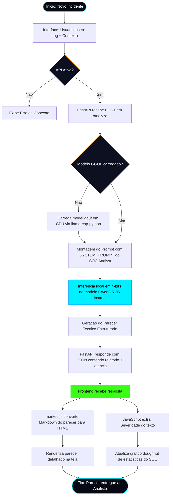
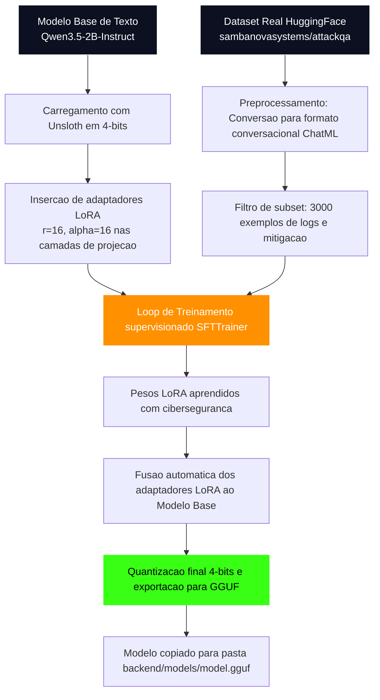

# 📊 Fluxograma de Funcionamento — CyberSentinel

Este documento contém a representação em diagramas do ciclo de vida e processamento do agente inteligente CyberSentinel.

---

## 🔄 1. Fluxograma de Execução do Agente (Inferência Local)

O diagrama a seguir descreve a jornada de um log bruto de segurança desde sua entrada na interface até o processamento local pela LLM fine-tuned e a exibição das respostas estruturadas de mitigação no painel.

---

## 🧠 2. Diagrama do Fluxo de Fine-Tuning (Treinamento)

Este diagrama detalha como o modelo especialista é gerado a partir do dataset real antes de ser exportado para o ambiente local Docker.

