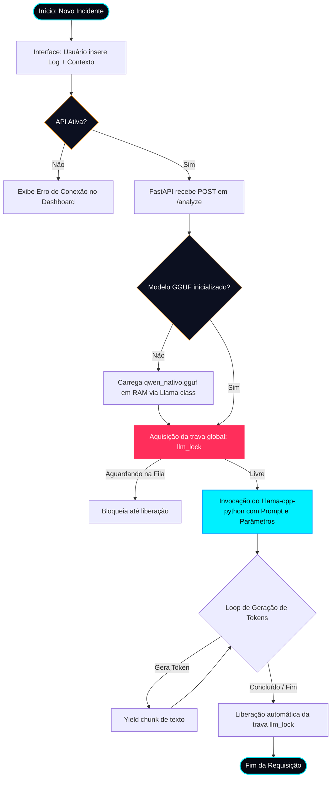
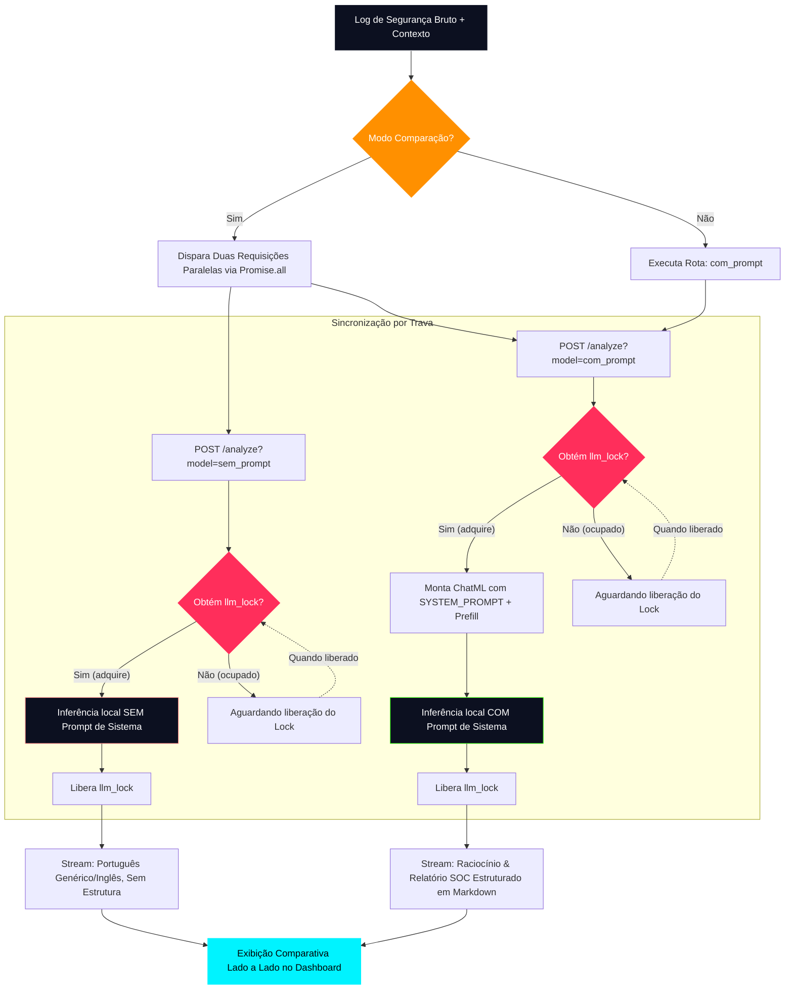

# 📊 Fluxograma de Funcionamento — CyberSentinel

Este documento contém a representação em diagramas (sintaxe Mermaid.js) do ciclo de vida, fluxo de processamento concorrente e arquitetura de dados do agente inteligente **CyberSentinel**.

---

## 🔄 1. Fluxograma de Execução do Agente (Inferência Local com Lock)

O diagrama a seguir descreve a jornada de um log bruto de segurança desde a submissão no Frontend até o processamento síncrono no backend FastAPI (através do mecanismo de bloqueio de concorrência) e a renderização do stream final.



---

## 🧠 2. Diagrama do Fluxo de Comparação (Engenharia de Prompt Concorrente)

Este diagrama detalha como a requisição de análise é direcionada e processada no modo comparativo para evidenciar o impacto da Engenharia de Prompt no modelo base. Como as duas requisições são disparadas em paralelo pelo frontend (`Promise.all`), a sincronização com `llm_lock` é crítica.



---

## 📥 3. Entradas, Processamento e Saídas (PEAS)

O ciclo de vida de dados do agente segue o paradigma tradicional de processamento:

```
📥 ENTRADAS                        🧠 PROCESSAMENTO                      📤 SAÍDAS
- Log Bruto (Syslog, SSH, etc.)   - Formatação ChatML                   - Raciocínio (<think>)
- Contexto da TI                  - Sincronização por Thread-Lock       - Classificação de Risco
- Parâmetro Model (com/sem)       - Inferência GGUF CPU Otimizada       - MITRE ATT&CK, CIA & Mitigação
```
